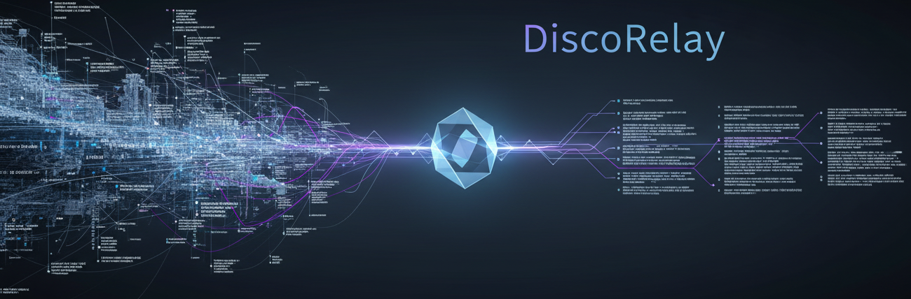

<p align="center">
  
</p>

<p align="right">
  
  
  
</p>

A lightweight Discord webhook notification relay that keeps your data private. Receives webhooks from your services, formats them into clean Discord embeds, and routes them to the right channel.

> **Not intended to replace [Notifiarr](https://github.com/Notifiarr). If you want the most polished appearance and actively maintained solution, [Notifiarr](https://github.com/Notifiarr) is the better choice.**

## Supported Sources

| Source | Endpoint | Routes to |
|--------|----------|-----------|
| Grafana | `/webhook/grafana` | critical/warning (auto by severity) |
| Radarr | `/webhook/radarr` | media |
| Sonarr | `/webhook/sonarr` | media |
| Lidarr | `/webhook/lidarr` | media |
| Tautulli | `/webhook/tautulli` | media (server events: critical) |
| Backrest | `/webhook/backrest` | critical/warning/backups (auto by status) |
| Uptime Kuma | `/webhook/uptimekuma` | critical (down) / daily (up) |
| Home Assistant | `/webhook/homeassistant` | critical/warning/daily (auto by severity) |
| UnRAID | `/webhook/unraid` | critical/warning/daily (auto by importance) |
| CrowdSec | `/webhook/crowdsec` | warning (bans, captchas, throttles) |
| UniFi | `/webhook/unifi` | critical/warning/daily (auto by severity) |
| check4updates | `/webhook/check4updates` | updates |

## Embed Style

Embeds follow the [Notifiarr](https://github.com/Notifiarr) convention:

- **Author line**: Service icon + event label (e.g., "Grabbed — Radarr")
- **Title**: Primary subject (movie name, alert name, IP address)
- **Inline field triplets**: Metadata in rows of 3 (Quality / Size / Indexer)
- **Thumbnails**: Media posters, album covers
- **Code blocks**: Release names, custom formats, GeoIP data
- **Footer**: Eastern Time timestamp
- **Color-coded**: Event type determines embed color

## Setup

```bash
cp config.example.json config.json
# Edit config.json — paste your Discord webhook URLs
docker compose up -d
```

## Config

Edit `config.json`:
- `discord.critical` — critical alerts (security, outages)
- `discord.warning` — warnings (CrowdSec bans, degraded services)
- `discord.daily` — informational / resolved notifications
- `discord.media` — media grabs, imports, playback
- `discord.backups` — backup success notifications
- `discord.updates` — container/service update notifications
- `port` — server port (default 3080)

## Service Configuration

Point each service's webhook URL to `http://discorelay:3080/webhook/<source>`.

### Grafana
Alerting → Contact Points → New → Webhook → URL: `http://discorelay:3080/webhook/grafana`

### Radarr / Sonarr / Lidarr
Settings → Connect → Add → Webhook → URL: `http://discorelay:3080/webhook/radarr` (etc.)

### Tautulli
Settings → Notification Agents → Add → Webhook → URL: `http://discorelay:3080/webhook/tautulli`

### Backrest
Settings → Notifications → Webhook → URL: `http://discorelay:3080/webhook/backrest`

### Uptime Kuma
Settings → Notifications → Webhook → URL: `http://discorelay:3080/webhook/uptimekuma`

### Home Assistant
Automations → Actions → REST command or `notify.rest` → URL: `http://discorelay:3080/webhook/homeassistant`

### UnRAID
User Scripts or notification agent → Webhook → URL: `http://discorelay:3080/webhook/unraid`

### CrowdSec
Configure the [HTTP notification plugin](https://docs.crowdsec.net/docs/notification_plugins/http/) → URL: `http://discorelay:3080/webhook/crowdsec`

### UniFi
Forward controller events/syslog → URL: `http://discorelay:3080/webhook/unifi`

### check4updates
Configure check4updates container webhook → URL: `http://discorelay:3080/webhook/check4updates`

## Health Check

```
GET /health
```

Returns `{ status: "ok", sources: [...] }` with all loaded parser names.

## Adding New Sources

Drop a new parser in `src/parsers/<name>.js`. Export a `parse(body, config)` function that returns an array of embed objects with a `route` property. Restart the container.
